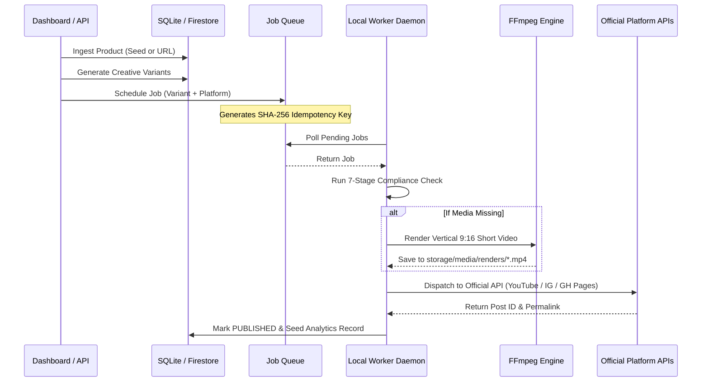

# Automation & Worker Architecture

## 1. Automation Pipeline

---

## 2. Modes of Operation

1. **`MANUAL`**:
   - Every piece of generated content requires explicit human confirmation via the web dashboard before scheduling or publishing.
2. **`SEMI_AUTOMATIC` (Default)**:
   - High-confidence products (Score >= 70) with 100% passed compliance validation are automatically approved.
   - Any variant triggering a warning or having lower confidence is held for review.
3. **`AUTONOMOUS`**:
   - End-to-end autonomous discovery, scoring, video creation, scheduling, and strategic optimization loop.
