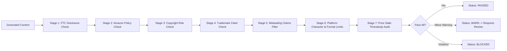

# Content Compliance & Copyright Guardrails

## 1. Regulatory & Policy Foundation

The **Content Compliance Engine** enforces strict adherence to:
1. **FTC (Federal Trade Commission) Endorsement Guides**: Clear and conspicuous disclosures before links or calls-to-action.
2. **Amazon Associates Operating Agreement**:
   - Must explicitly state: *"As an Amazon Associate I earn from qualifying purchases."*
   - Prohibition against cloaking or disguising affiliate links deceptively.
   - Prohibition against hardcoding dynamic Amazon prices in static text without timestamp disclosures.
   - Prohibition against claiming Amazon itself endorses or sponsors the content.
3. **Platform Terms of Service (Meta, YouTube, Pinterest)**:
   - Proper commercial content tagging (`#ad`, `#sponsored`, or YouTube paid promotion disclosure checkbox).

---

## 2. Seven-Stage Compliance Filter Pipeline

Before any content variant or video can transition to `APPROVED` or `QUEUED`, it must pass all 7 validation stages:

### Stage 1: FTC Disclosure Verification
- Verifies that `#ad`, `#commissionsearned`, or `#affiliate` is present in the visible portion of captions.
- Flags content where disclosures are buried at the bottom after 20 hashtags.

### Stage 2: Amazon Associates Verification
- Ensures the affiliate tag format matches valid syntax (`[a-zA-Z0-9_-]+-[0-9]{2}`).
- Verifies the affiliate tag `mybudgetdeal9-21` is accurately embedded.
- Forbids deceptive claims like "Free giveaway directly from Amazon".

### Stage 3: Copyright & Media Origin
- Media assets must originate from:
  1. Procedurally generated vectors/typography created by Pillow.
  2. Royalty-free licensed sound effects / music or local procedural audio.
  3. Direct manufacturer product images provided via official product catalog feeds.
- Any attempt to scrape and slice third-party influencer TikToks/Reels is explicitly prohibited.

### Stage 4: Trademark Protection
- Prohibits unauthorized use of competitor logos or claims of official partnership ("Official Apple Dealer", etc.).

### Stage 5: Misleading Claims
- Regex scans for high-risk forbidden phrases: "Guaranteed to cure", "100% free money", "Get rich quick", "Amazon secret glitch".

### Stage 6: Format & Constraint Validation
- Instagram Reels: Under 90s, 9:16 aspect ratio, under 2200 caption characters.
- YouTube Shorts: Under 60s, 9:16 aspect ratio, under 100 title characters.
- Pinterest: 1000x1500 or 9:16 ratio, under 500 description characters.

### Stage 7: Price Freshness Check
- Any mention of explicit prices must append: *"Price at time of publication; subject to change on Amazon."*
