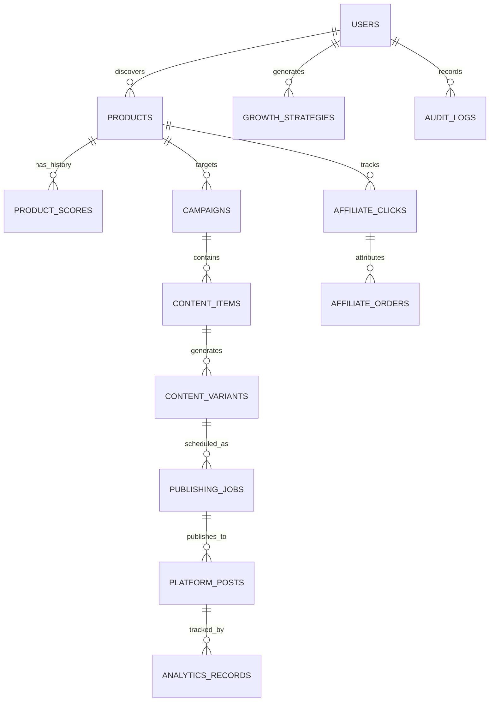

# Data Model Specification: AI Affiliate Growth Engine

## Overview
Data is split cleanly between **Metadata / State (Firestore / SQLite)** and **Heavy Media Blobs (Local Storage)**.

---

## 1. Entity Relationship Diagram

---

## 2. Core Collections Schema

### 2.1 `products`
- `id`: `string` (UUID or sanitized ASIN, e.g. `B09XYZ1234`)
- `asin`: `string`
- `title`: `string`
- `category`: `string` (e.g., "Electronics", "Home & Kitchen", "Fitness")
- `original_price`: `float`
- `current_price`: `float`
- `currency`: `string` (e.g., "INR", "USD")
- `discount_percent`: `float`
- `rating`: `float` (0.0 to 5.0)
- `review_count`: `int`
- `affiliate_url`: `string` (Affiliate link containing tag `mybudgetdeal9-21`)
- `canonical_url`: `string`
- `image_urls`: `list[string]` (Official product images or clean renders)
- `availability`: `enum("IN_STOCK", "OUT_OF_STOCK", "UNKNOWN")`
- `discovery_source`: `enum("MANUAL_SEED", "RSS_FEED", "TREND_SCRAPER", "PA_API")`
- `latest_score`: `float` (0-100)
- `created_at`: `timestamp`
- `updated_at`: `timestamp`

### 2.2 `product_scores`
- `id`: `string`
- `product_id`: `string` (Foreign Key -> `products.id`)
- `demand_score`: `float` (0-100)
- `trend_score`: `float` (0-100)
- `competition_score`: `float` (0-100)
- `monetization_score`: `float` (0-100)
- `content_potential_score`: `float` (0-100)
- `conversion_potential_score`: `float` (0-100)
- `overall_score`: `float` (Weighted composite)
- `scoring_weights_version`: `string` (e.g. "v1.0")
- `ai_rationale`: `string` (Explainable AI narrative: why this product was scored high/low)
- `calculated_at`: `timestamp`

### 2.3 `campaigns`
- `id`: `string`
- `product_id`: `string` (Foreign Key -> `products.id`)
- `title`: `string`
- `objective`: `enum("AWARENESS", "ENGAGEMENT", "CONVERSION", "FLASH_DEAL")`
- `status`: `enum("DRAFT", "ACTIVE", "PAUSED", "COMPLETED")`
- `budget`: `float` (Default 0.0 for organic)
- `target_platforms`: `list[string]` (["instagram", "youtube", "facebook", "pinterest"])
- `created_at`: `timestamp`

### 2.4 `content_variants`
- `id`: `string`
- `campaign_id`: `string`
- `product_id`: `string`
- `angle_type`: `enum("PROBLEM_SOLUTION", "TOP_3_BENEFITS", "PRICE_DROP", "MISTAKE_TO_AVOID", "COMPARISON")`
- `hook_text`: `string`
- `body_script`: `string`
- `cta_text`: `string`
- `disclosure_text`: `string` (e.g. "As an Amazon Associate I earn from qualifying purchases #ad")
- `hashtags`: `list[string]`
- `media_type`: `enum("SHORT_VIDEO", "IMAGE_POST", "CAROUSEL")`
- `local_media_path`: `string` (Relative path to local render, e.g. `storage/media/renders/B09_v1.mp4`)
- `compliance_status`: `enum("PENDING", "PASSED", "FLAGGED", "REJECTED")`
- `compliance_notes`: `list[string]`
- `approval_status`: `enum("PENDING_APPROVAL", "APPROVED", "REJECTED")`
- `approved_by`: `string` ("HUMAN" or "AUTO_ENGINE")
- `created_at`: `timestamp`

### 2.5 `publishing_jobs`
- `id`: `string`
- `content_variant_id`: `string`
- `platform`: `enum("INSTAGRAM", "YOUTUBE", "FACEBOOK", "PINTEREST", "GITHUB_PAGES")`
- `scheduled_time`: `timestamp`
- `status`: `enum("SCHEDULED", "QUEUED", "PROCESSING", "PUBLISHED", "FAILED", "CANCELLED")`
- `attempt_count`: `int`
- `max_attempts`: `int` (Default 3)
- `idempotency_key`: `string` (SHA256 of `platform + variant_id + scheduled_date`)
- `platform_post_id`: `string` (Assigned upon successful API publishing)
- `platform_post_url`: `string`
- `error_message`: `string` (if failed)
- `published_at`: `timestamp`

### 2.6 `analytics_records`
- `id`: `string`
- `platform_post_id`: `string`
- `platform`: `string`
- `product_id`: `string`
- `impressions`: `int`
- `views`: `int`
- `likes`: `int`
- `comments`: `int`
- `shares`: `int`
- `saves`: `int`
- `clicks`: `int`
- `collected_at`: `timestamp`

### 2.7 `affiliate_performance`
- `id`: `string`
- `product_id`: `string`
- `period_date`: `date`
- `clicks`: `int`
- `ordered_items`: `int`
- `shipped_items`: `int`
- `conversion_rate`: `float`
- `commission_earned`: `float`
- `currency`: `string`

### 2.8 `growth_strategies`
- `id`: `string`
- `type`: `enum("SCALE_PRODUCT", "KILL_PRODUCT", "ADJUST_CTA", "HOOK_AB_TEST", "PLATFORM_REALLOCATION")`
- `rationale`: `string`
- `proposed_action`: `string`
- `status`: `enum("PROPOSED", "ACCEPTED", "DISMISSED", "EXECUTED")`
- `created_at`: `timestamp`

### 2.9 `system_settings`
- `id`: `string` ("singleton_config")
- `approval_mode`: `enum("MANUAL", "SEMI_AUTOMATIC", "AUTONOMOUS")`
- `scoring_weights`: `json` (demand, trend, competition, etc.)
- `default_affiliate_tag`: `string` ("mybudgetdeal9-21")
- `max_daily_posts_per_platform`: `dict[string, int]`
- `compliance_strict_mode`: `bool` (true)
