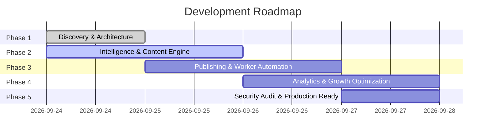

# AI Affiliate Growth Engine Roadmap & Risk Register

## 1. 5-Phase Autonomous Implementation Roadmap

- [x] **Phase 1: Architecture, Data Model, Security & Compliance**
  - [x] Codebase & toolchain inspection (Python 3.14, Node 24, FFmpeg 9.0 verified)
  - [x] Architectural specification & component diagrams
  - [x] Complete Firestore & Local Storage schemas
  - [x] Compliance, FTC, and Amazon Associates guardrails
  - [x] Pre-PA-API bootstrap roadmap for tag `mybudgetdeal9-21`

- [ ] **Phase 2: Product Intelligence & Creative Generation Engine**
  - [ ] Reusable `ProductDiscoveryEngine` with seed catalog, URL canonicalization, and PA-API interface
  - [ ] Multi-factor `ProductScoringEngine` (Demand, Trend, Competition, Monetization, Content Potential)
  - [ ] AI Content Strategy & Copywriting engine (Angles, Hooks, Scripts, Disclosures)
  - [ ] Media & Video Synthesis engine (Procedural Pillow overlays, FFmpeg 9:16 vertical render, audio integration)
  - [ ] 7-stage automated Compliance Validation filter

- [ ] **Phase 3: Automation & Multi-Platform Publishing**
  - [ ] Local Worker daemon with resilient job queue & exponential retry backoff
  - [ ] Official publisher abstractions (Instagram Graph API, YouTube Data API v3, Pinterest API v5, GitHub Pages site sync)
  - [ ] Human Approval system (Manual, Semi-Automatic, Autonomous modes)
  - [ ] Content calendar scheduling & duplicate-publication protection

- [ ] **Phase 4: Analytics, Attribution & Growth Optimization**
  - [ ] Multi-platform analytics ingestion (views, retention, clicks, engagement)
  - [ ] Affiliate conversion tracking & revenue per mille (RPM) calculations
  - [ ] AI Growth Strategist (identifying top-converting hooks, underperforming products, CTA optimizations)
  - [ ] Automated A/B variant testing engine

- [ ] **Phase 5: Verification, Security Audit & Production Review**
  - [ ] Comprehensive unit, integration, and end-to-end test execution
  - [ ] Zero-secret leak audit (`.env` sanitation, log scrubbers)
  - [ ] Performance profiling & zero-cost limit validation

---

## 2. Risk Register & Mitigation Strategies

| ID | Risk Description | Severity | Probability | Mitigation Strategy |
| :--- | :--- | :--- | :--- | :--- |
| **R1** | Amazon PA-API inaccessible before 3 qualifying sales | HIGH | HIGH (100%) | Implement `SeedCatalogProvider` and `UrlNormalizeProvider` with affiliate tag `mybudgetdeal9-21`, generating valid Amazon links while tracking towards qualifying sales. |
| **R2** | Social platform rate limiting or quota exhaustion | MEDIUM | MEDIUM | Job queue rate limiter with backoff, token bucket per platform, and strict daily posting caps. |
| **R3** | Copyright infringement or account bans from scraped media | CRITICAL | HIGH (if unmitigated) | Absolute ban on third-party video scraping. Content is procedurally generated with Pillow/FFmpeg using clean licensed templates and open audio. |
| **R4** | Account password leakage in source/logs | CRITICAL | LOW (after audit) | Strip all raw credentials. Enforce `.env.example`, `.gitignore`, and log sanitization filters. |
| **R5** | High cloud storage costs for video renders | MEDIUM | HIGH (if cloud-hosted) | Store all high-resolution video files exclusively on the local machine (`storage/media/`). Cloud database (Firestore) stores only lightweight metadata. |
